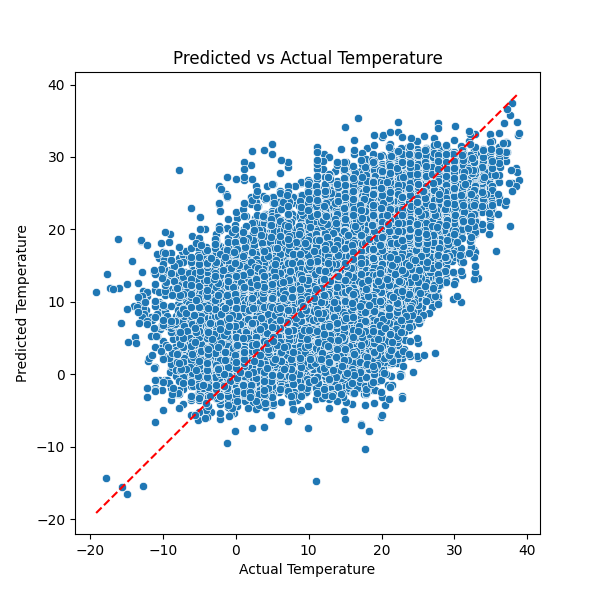
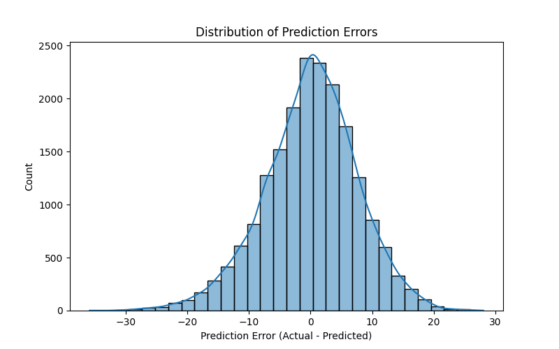

# Temperature Regression: Random Forest

## Model Training
- Random Forest Regressor with 100 trees and max depth 10.
- Selected features - humidity and wind speed
- Split data into training (80%) and testing (20%) sets.

---

## Results

### Actual vs Predicted Temperature

The model predictions deviate substantially from the actual temperature values over the test samples, showing poor performance.

### Error Distribution

The residual errors are roughly centered around zero so the training is not systematically wrong but the data has a large spread, indicating the model is inconsistent.
**Root Mean Squared Error (RMSE):** 7.62

---

## Next Steps
- A clear next step would be to add additional features, like one corresponding to lagged temperature, e.g. the temperature at the same time on the previous day

---
