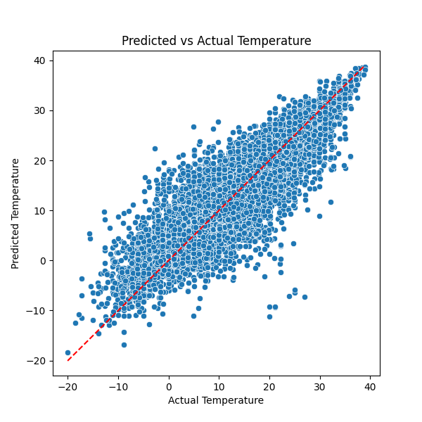
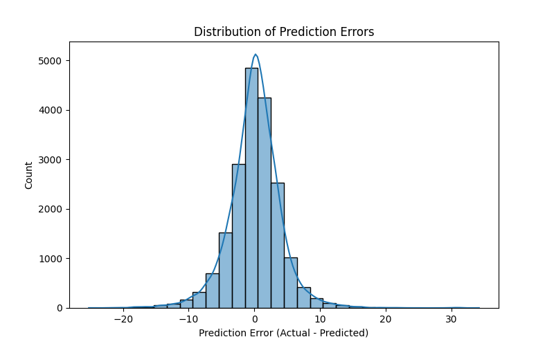

# Temperature Regression: Random Forest added features

## Model Training
- Trained a Random Forest Regressor on selected features - humidity and wind speed and temperature lag
- Split data into training (80%) and testing (20%) sets.

---

## Results

### Actual vs Predicted Temperature

The model predictions are better than before: we see a lot closer alignment between the actual and predicted temperatures.

### Error Distribution

The residual errors are roughly centered around zero so the training is not systematically wrong and the data has a smaller spread, indicating the model is more consistent.
**Root Mean Squared Error (RMSE):** 3.99

---

## Next Steps
- Experiment with different models to improve accuracy
- Incorporate additional weather features

---

*Report generated on 2025-07-31*
