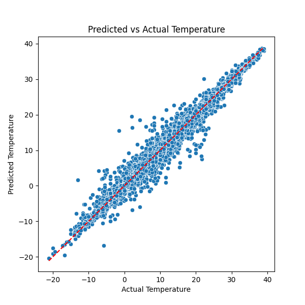

# Temperature Regression: Random Forest added features

## Model Training
- Random Forest Regressor with 100 trees and max depth 10. (Same as in 1_)
- Selected features - humidity and wind speed but now additionally temperature lag of (1h, 6h, 12h, 24h)
- Split data into training (80%) and testing (20%) sets.

---

## Results

### Actual vs Predicted Temperature

The model predictions are substantially better than before: we see a lot closer alignment between the actual and predicted temperatures.

### Error Distribution

The model is drastically more consistent than before
**Root Mean Squared Error (RMSE):** 1.16  
*Substantial improvement from the previous 3.99 RMSE.*

---

## Next Steps
- Can we improve the RMSE further? And can we do that without any substantial increases to computation time?

---

*Report generated on 2025-07-31*
