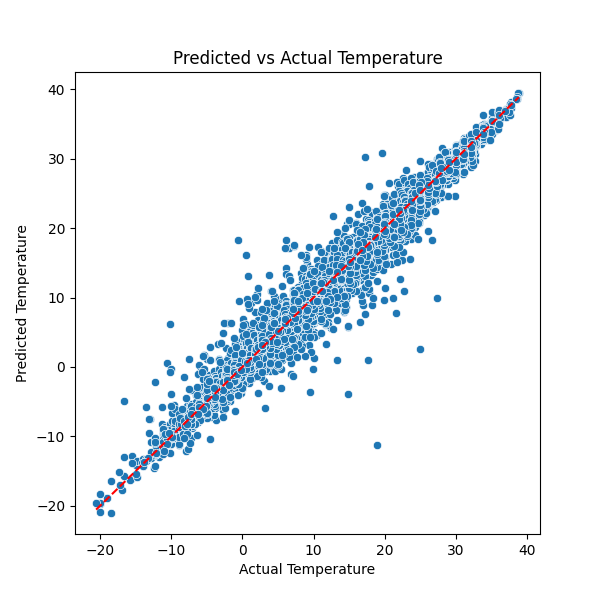
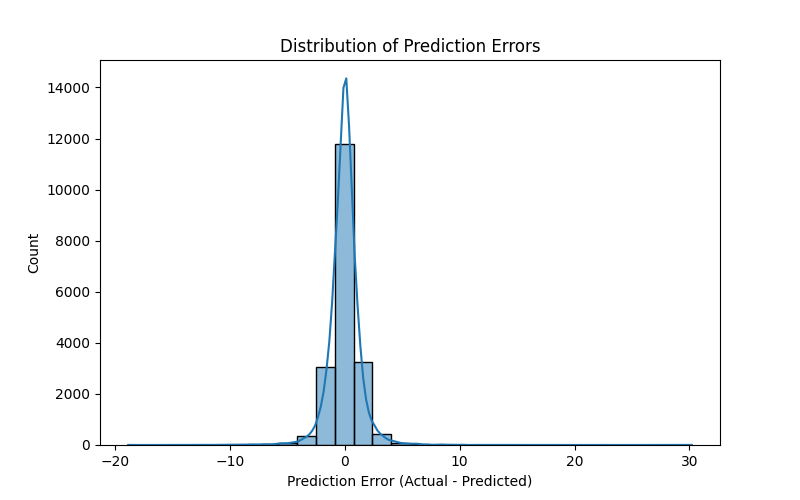

# Temperature Regression: Random Forest added features

## Model Training
- Random Forest Regressor with 100 trees and max depth 10, (same as in 1_, 2_) but now with a greater minimum number of samples per leaf which should help prevent overfitting on outliers
- Selected features - just the hour and 1hr lag (these were found to be the most important)
- Split data into training (80%) and testing (20%) sets.

---

## Results

### Actual vs Predicted Temperature

The predicted vs actual is comparable to before, whilst only relying on two features.

### Error Distribution

The model is almost as consistent as before
**Root Mean Squared Error (RMSE):** 1.29
*Comparable to the previous 1.16 RMSE.*

---

## Next Steps
- Can we eek out even more accuracy for a similar compute time?

---

*Report generated on 2025-07-31*
