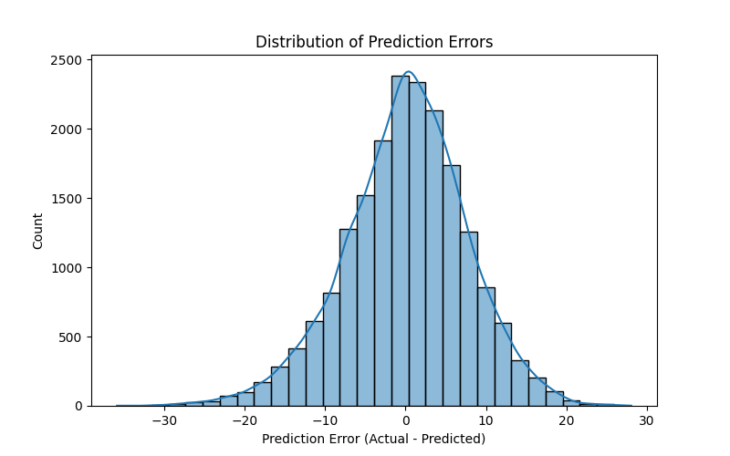

# Temperature Regression Project Report

## Overview
This project aims to predict temperature based on weather features using machine learning regression models.

---

## Data Preprocessing
- Dates converted to datetime with timezone handling.
- Feature engineering ito extract hour and weather condition variables.
- Data cleaned for missing or invalid entries.

---

## Model Training
- Trained a Random Forest Regressor on selected features.
- Split data into training (80%) and testing (20%) sets.

---

## Results

### Actual vs Predicted Temperature

The model predictions deviate substantially from the actual temperature values over the test samples, showing poor performance.

### Error Distribution

The residual errors are roughly centered around zero so the training is not systematically wrong but the data has a large spread, indicating the model is inconsistent.
**Root Mean Squared Error (RMSE):** 7.62

---

## Next Steps
- Experiment with different models to improve accuracy
- Incorporate additional weather features

---

*Report generated on 2025-07-31*
